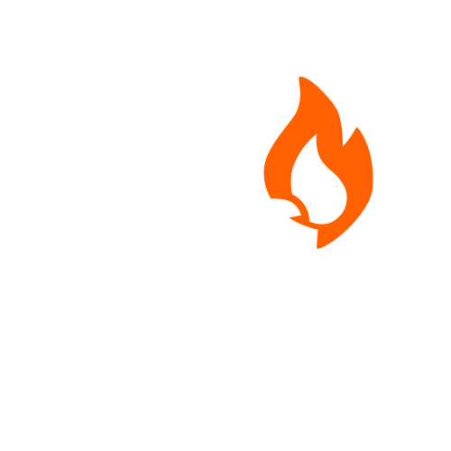

# Proxy for Firebase Notification Service (PFNS)



## Introduction

**Proxy for Firebase Notification Service (PFNS)** is a modern tool designed to simplify communication between external private instances and Firebase Cloud Messaging (FCM). This project allows private instances to send push notifications directly to mobile devices or tablets via FCM. Additionally, PFNS supports pushing configuration data using scannable QR codes, which streamlines the setup process by eliminating the need to manually enter LAN addresses or public FQDNs. By assigning a unique `serverId` during API key creation, PFNS restricts communications to only those devices that are authorized to interact with your instance—helping to reduce the risk of accidental cross-instance communication (though it is not a full-proof guarantee).

## Tech Stack

PFNS is built using modern technologies for both the frontend and backend:

- **Frontend:**
  - **React** with **TypeScript** and **JSX** for a dynamic and type-safe user experience.

- **Backend:**
  - **Spring Boot** with **Kotlin** for robust API handling and service architecture.

## How It Works

PFNS manages communication through the following flow:

```
External Private Instance --> PFNS --> Firebase Cloud Messaging --> Mobile/Tablet
```

In addition to delivering push notifications, PFNS offers:
- **Automatic Device Configuration:** Devices can be easily configured via scannable QR codes, eliminating the need for manual network address entry.
- **Secure API Access:** Generating API keys using a unique `serverId` ensures that only authorized devices can communicate with your instance.

## Installation

This project is divided into two main components: **frontend** and **backend**.

### Prerequisites

- **Frontend:**
  - Node.js and npm

- **Backend:**
  - Java Development Kit (JDK)
  - Kotlin
  - Gradle

- A valid Firebase Cloud Messaging account with the necessary API keys.

### 1. Clone the Repository

Clone the repository to your local machine:

```bash
git clone https://github.com/iktdev-no/pfns.git
```

```web``` - React frontend

```src``` - Backend code

# Usage
Generate an API Key: Create an API key using your unique serverId. This step limits communication to only the devices authorized for your instance.

Register Devices: Use the scannable QR codes to push configuration data to devices. This automated process simplifies device setup by eliminating the need for manual entry of network addresses.

Send Push Notifications or Configuration Updates: Utilize the provided API to deliver push notifications or configuration updates from external instances via PFNS using Firebase Cloud Messaging.

# Future Plans
Notification Forwarding: Expanding functionality to support direct forwarding of notifications, enabling even smoother message delivery from instances to devices.

Enhanced Security: Further development of validation mechanisms surrounding serverId to improve secure communication.

Extended Configuration Support: Adding more integrations and automated configuration methods to enhance the overall user experience.